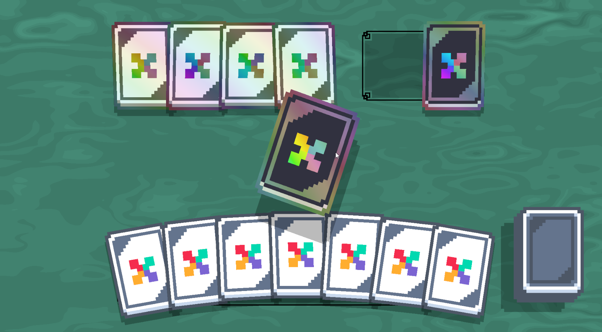

# Learn | Balatro's Game Feel | Mitfart

A Learning project to demonstrate my skills​

## Getting Started
These instructions will get you a copy of the project up and running on your local machine for development and testing purposes.

### Prerequisites
*   Unity ver. 2023.2 or higher

### Running the project
After cloning or downloading the repository, open the root project folder in unity and press the Play button.
You can see a running demo of the project on [this site](https://mitfart.itch.io/learn-balatro).

## Built With
*   [DOTween](http://dotween.demigiant.com/) - DOTween is a fast, efficient, fully type-safe object-oriented animation engine for Unity, optimized for C# users, free and open-source, with tons of advanced features

## Authors
Game Development
*   **Dmitriy Zarichan** - [Github](https://github.com/Mitfart)

## License
This project is licensed under the MIT License